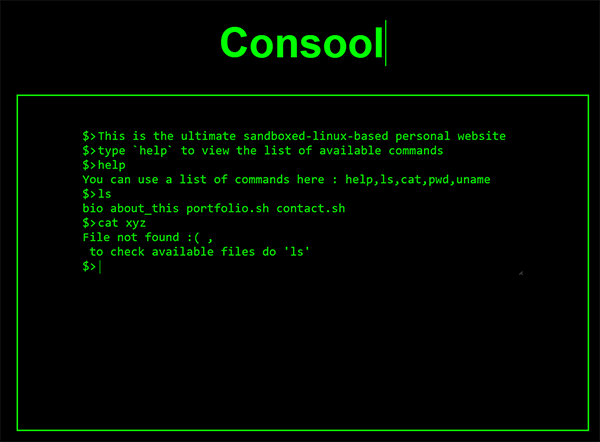

# Consool

An attempt to make a "CLI" based personal website .
I started this to waste my time in my Computer-Science lectures because it should be obvious by now that i dont need to learn HTML and CSS :D

This is the front-end based on React js ( create-react-app )

The Backend is in a [separate repo (/alhasaniq/consool-backend)](https://github.com/alhasaniq/consool-backend)

## Screenshots

## Dev
to start the development server run `npm start`

## Author
[Alhasan Ahmed Abd](https://github.com/alhasaniq)
